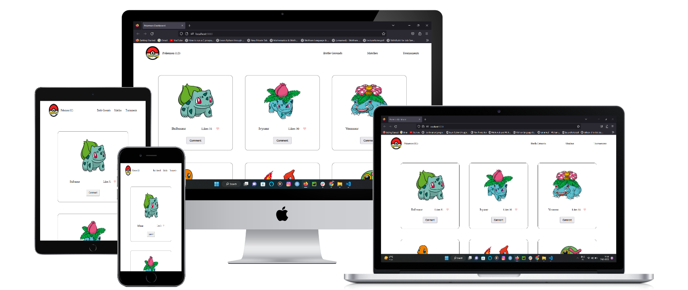

<a name="readme-top"></a>
<div align="center">
  
  

  <br/>
  <h1><b>Pokemon Dashboard</b><br><br></h1>
  
 </div>

<div align="center">
  <h1>App Mock</h1>
  
</div>
<br>
<br>
<br>
<!-- TABLE OF CONTENTS -->

# 📗 Table of Contents

- [📖 About the Project](#about-project)
 - [🧪 Linters And Deployment](#linters)
  - [🛠 Built With](#built-with)
    - [Tech Stack](#tech-stack)
    - [Key Features](#key-features)
  - [🚀 Live Demo](#live-demo)
- [💻 Getting Started](#getting-started)
  - [Setup](#setup)
  - [Prerequisites](#prerequisites)
  - [Install](#install)
  - [Usage](#usage)
  - [Run tests](#run-tests)
  - [Deployment](#triangular_flag_on_post-deployment)
- [👥 Authors](#authors)
- [🔭 Future Features](#future-features)
- [🤝 Contributing](#contributing)
- [⭐️ Show your support](#support)
- [🙏 Acknowledgements](#acknowledgements)
- [❓ FAQ ](#faq)
- [📝 License](#license)

<!-- PROJECT DESCRIPTION -->

# 📖 Pokemon Dashboard <a name="about-project"></a>

This Project is a pokemon social media, where you can like comment on you fav Pokemon

**Pokemon Dashboard** is a JavaScript and API-based project

## 🧪 Linters And Deployment <a name="linters"></a>
[](https://github.com/martinkarugaba/pokemon-dashboard/actions/workflows/linters.yml)
[](https://github.com/martinkarugaba/pokemon-dashboard/actions/workflows/pages/pages-build-deployment)

## 🛠 Built With <a name="built-with"></a>

### Tech Stack <a name="tech-stack"></a>

In this project We used many skills, tech and libraries

<details>
  <summary>Documentation</summary>
  <ul>
    <li><a href="https://html.com">HTML</a></li>
  </ul>
</details>

<details>
  <summary>Styling</summary>
  <ul>
    <li><a href="https://www.w3.org">CSS</a></li>
  </ul>
</details>

<details>
<summary>Dynamics And Logics</summary>
  <ul>
    <li><a href="https://www.javascript.com">JavaScript</a></li>
  </ul>
</details>
<details>
<summary>API involved</summary>
  <ul>
    <li><a href="https://pokeapi.co/"></a>Pokemon API</li>
    <li><a href="https://www.notion.so/microverse/Involvement-API-869e60b5ad104603aa6db59e08150270">Involvement API</a></li>
  </ul>
</details>


<br>

<!-- Features -->

### Key Features <a name="key-features"></a>


- **You can check your pokemon**
- **you can add likes for your fav pokemon**
- **you can add comments for your fav pokemon**
- **Nice animation and popup**


<p align="right">(<a href="#readme-top">back to top</a>)</p>

<!-- LIVE DEMO -->

## 🚀 Live Demo <a name="live-demo"></a>

This link will guide you to our project and presentation

- [Live Demo Link](https://martinkarugaba.github.io/pokemon-dashboard/dist/)
- [Loom Video](https://www.loom.com/share/c97562d2fb964f129f4151ee5d42b9a7)

<p align="right">(<a href="#readme-top">back to top</a>)</p>

<!-- GETTING STARTED -->

## 💻 Getting Started <a name="getting-started"></a>

For having local file and project you can fork this repo or clone it using `git clone https://github.com/PowerLevel9000/pokemon-dashboard.git`
And for making changes you you should follow prerequisites


### Prerequisites

In order to edit this project you need:

 - Any text editor such as note pad and word pad
 - A web browser
 - Node js installed
 - An IDE

#### Suggested IDE
 - Visual studio code `I prefer this one 🙃🙃`
 - Atom 
 - Sublime 
 - IntelliJ IDEA
 - Visual code 

### Setup

Clone this repository to your desired folder:

- Open your terminal there (bash cmd powershell run etc...) and run `npm i` to install node modules
- `npm run dev` or `npm run start` this will open project in browser
- If you to edit something edit in src dir and then run in terminal `npm run build` to build it for production

- Before deployment have some linter check 
  - [ ] `npx stylelint "**/*.{css,scss}"` for css and saas file
  - [ ] `npx eslint .` for js files
  - [ ] `npx hint .` for html files 

- After fixing error build deploy for production

### Install 
```
npm i 
```
### Usage

- Pokemon Rendering
- Commenting 
- Liking


### Run tests

- Currently, this Project don't have any Unit test
- You can do manual checking
  - Score added properly
  - Form validation for score and scorer work properly 

### Deployment

You can deploy this project using:

- For this repo and use git hub pages to deploy it 

<p align="right">(<a href="#readme-top">back to top</a>)</p>


<!-- AUTHORS -->

## 👥 Authors <a name="authors"></a>


👤 **Adarsh Pathak**

- GitHub: [@PowerLevel9000](https://github.com/githubhandle)
- Twitter: [@PowerLevel9002](https://twitter.com/PowerLevel9002?t=AIuSN7mTxk5a_MWpLolEjA&s=09)
- LinkedIn: [@Adarsh Pathak](https://www.linkedin.com/in/adarsh-pathak-56a831256/)

👤 **Martin Karugaba**

- GitHub: [@martinkarugaba](https://github.com/martinkarugaba)
- Twitter: [@martin_karugaba](https://twitter.com/martin_karugaba)
- LinkedIn: [@martin_karugaba](https://www.linkedin.com/in/martin-karugaba-822442173/)


<!-- FUTURE FEATURES -->

## 🔭 Future Features <a name="future-features"></a>

- [ ] **mobile and tablet version**
- [ ] **improve functionality**
- [ ] **improve styling**
- [ ] **infinite scroll**

<p align="right">(<a href="#readme-top">back to top</a>)</p>

<!-- CONTRIBUTING -->

## 🤝 Contributing <a name="contributing"></a>

Contributions, issues, and feature requests are welcome!

Feel free to check the [issues page](https://github.com/martinkarugaba/pokemon-dashboard/issues)).

<p align="right">(<a href="#readme-top">back to top</a>)</p>

<!-- SUPPORT -->

## ⭐️ Show your support <a name="support"></a>


If you like my Project give it a Star ✨🌟 

<p align="right">(<a href="#readme-top">back to top</a>)</p>

## ❓ FAQ <a name="faq"></a>

> ask questions to be here 

- **Question_1** How to close pop up

  - Answer_1 Click outside the popup or cross button

- **Question_2** How to add like 

  - Answer_2 Just Tap on the heart button and wait for awhile

<p align="right">(<a href="#readme-top">back to top</a>)</p>

<!-- LICENSE -->

## 📝 License <a name="license"></a>

This project is [MIT](https://github.com/martinkarugaba/pokemon-dashboard/blob/master/MIT.md) licensed.

<p align="right">(<a href="#readme-top">back to top</a>)</p>
